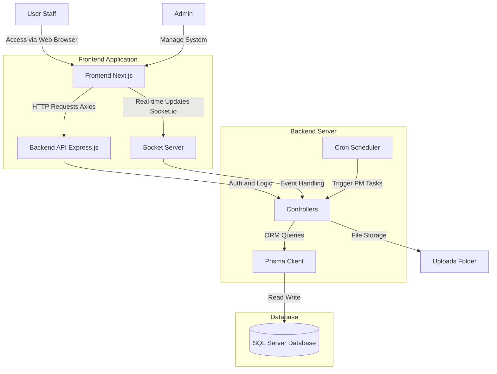

# Maintenance PM Project

Machine Preventive Maintenance System (Machine PM System)

## 1. Objectives

This project aims to develop a Preventive Maintenance (PM) management system for factory machinery. The main objectives are:
- To enhance the efficiency of machinery maintenance planning and tracking.
- To reduce machine downtime caused by unexpected breakdowns.
- To systematically store maintenance history and machine usage records.
- To enable management and staff to view machine status in real-time via a Dashboard.
- To facilitate the generation of maintenance reports and data analysis.

## 2. System Architecture (Flow Chart)

Diagram showing the system's operation and data flow.



## 3. Tech Stack

The technologies used in this project include:

### Frontend
- **Framework**: Next.js (React)
- **Styling**: Bootstrap, Tailwind CSS
- **HTTP Client**: Axios
- **Real-time Communication**: Socket.io Client
- **Utilities**: SweetAlert2, Dnd Kit, Recharts, jsPDF, XLSX

### Backend
- **Runtime**: Node.js
- **Framework**: Express.js
- **Database ORM**: Prisma
- **Real-time Communication**: Socket.io
- **Scheduling**: Node-cron
- **Email**: Nodemailer

### Database
- **Database System**: SQL Server

### Tools & DevOps
- **Version Control**: Git & GitHub
- **Package Manager**: npm

## 4. Features

The system consists of the following main functions:

### 4.1 Dashboard
- Overview of all machine statuses.
- Graphs displaying operational performance and PM plans.
- Notifications for upcoming maintenance tasks.

### 4.2 Machine Management
- Machine Master registry.
- Management of Machine Types.
- Tracking of machine operational status.

### 4.3 Preventive Maintenance (PM)
- PM Planning.
- PM Result Recording.
- Management of Preventive Types.
- Notification system for scheduled PM cycles.

### 4.4 User Management
- User Master and access rights management.
- Login/Authentication system.

### 4.5 Reports
- Maintenance history reports.
- Data export to Excel/PDF.

### 4.6 Real-time Features
- Real-time machine status updates using Socket.io.

## 5. Usage

### Prerequisites
- Node.js (v18 or higher recommended)
- SQL Server
- Git

### 5.1 Backend Installation & Setup

1. Navigate to the backend folder:
   ```bash
   cd backend
   ```
2. Install dependencies:
   ```bash
   npm install
   ```
3. Configure Database and Environment Variables in the `.env` file.
4. Start the Server:
   ```bash
   npm start
   ```
   The server will run on the specified port (Default: 5003).

### 5.2 Frontend Installation & Setup

1. Navigate to the frontend folder:
   ```bash
   cd frontend/my-app
   ```
2. Install dependencies:
   ```bash
   npm install
   ```
3. Run in Development mode:
   ```bash
   npm run dev
   ```
   Or build and run in Production mode:
   ```bash
   npm run build
   npm start
   ```
4. Open your browser and go to `http://localhost:3000` (or the configured port).

### 5.3 Project Structure
- **backend/**: Source code for Server API, Database connection, Scheduler.
- **frontend/my-app/**: Source code for the Web Interface (Next.js), Components, Pages.
- **database/**: SQL dump and database helper scripts.
- **docs/**: User, admin, API, deployment, environment, and troubleshooting documentation.
- **docs/assets/images/**: Documentation images.
- **tools/email/**: Standalone email automation scripts.
- **tests/email/**: Standalone email test utilities.

## 6. Repository Notes

- Copy `.env.example` files to `.env` in each app/tool folder before running locally.
- Do not commit `.env`, generated uploads, local virtual environments, logs, certificates, or private keys.
- The active app folders are `backend/` and `frontend/my-app/`; helper scripts are grouped under `tools/` and `tests/`.
