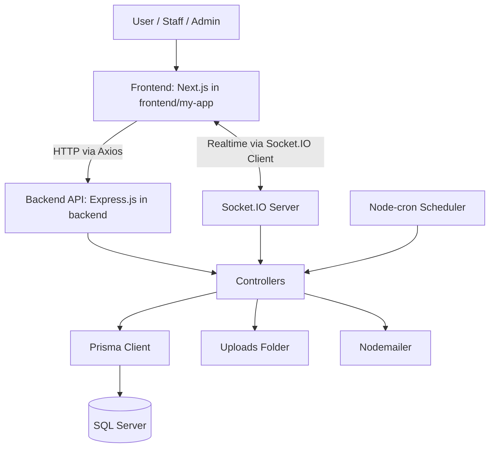
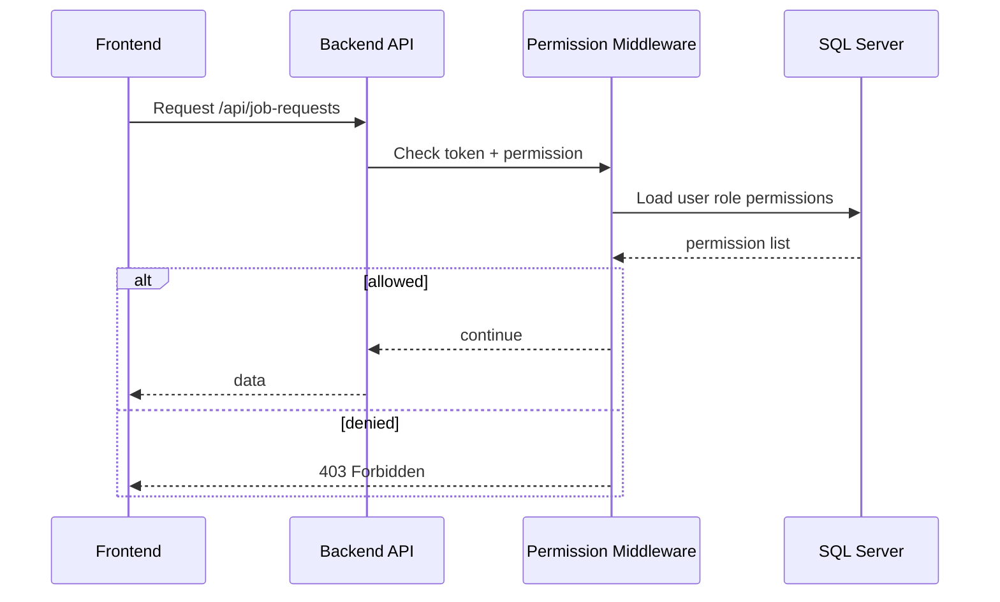
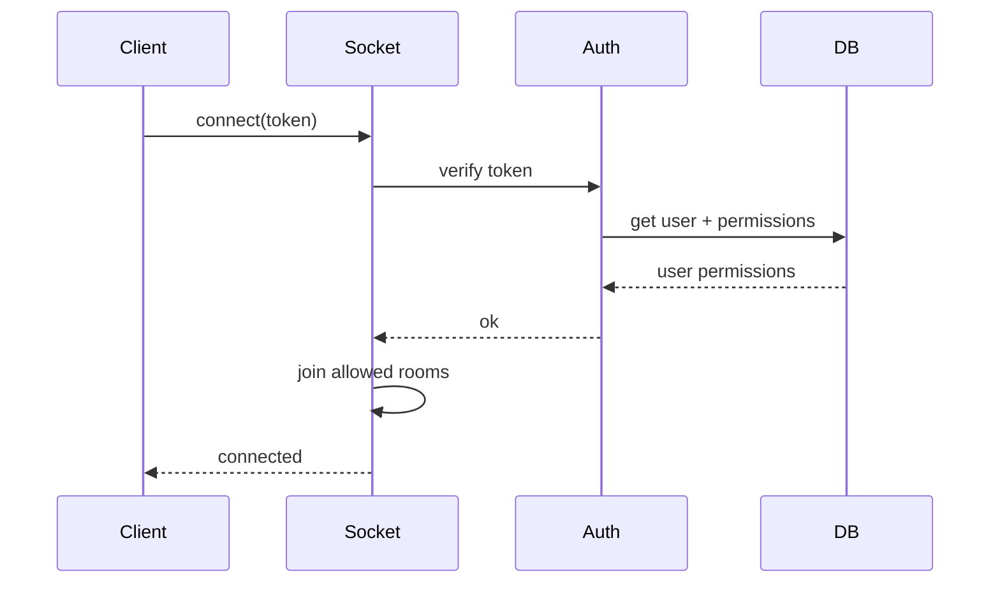
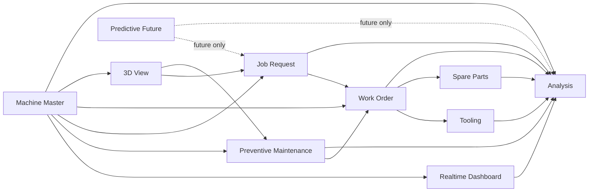
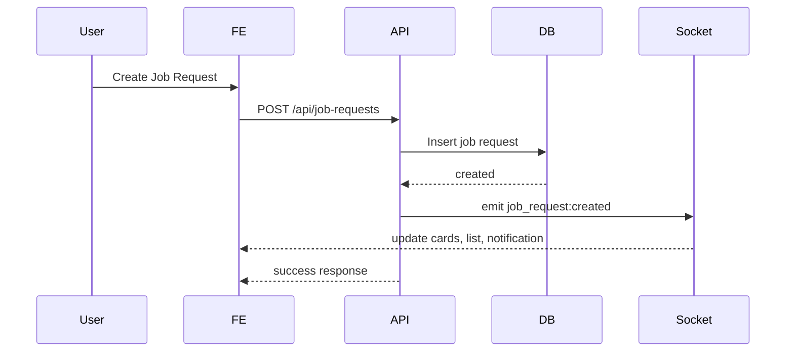
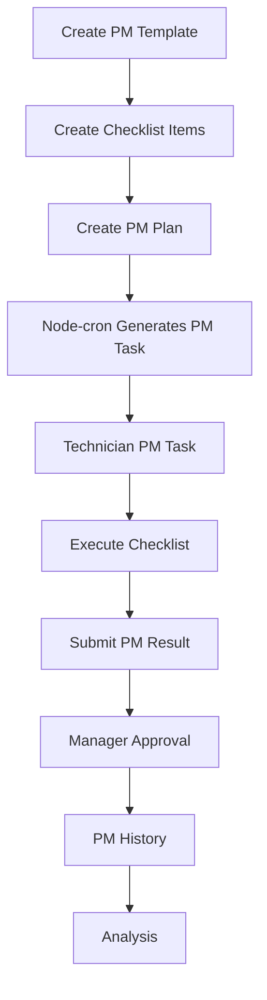
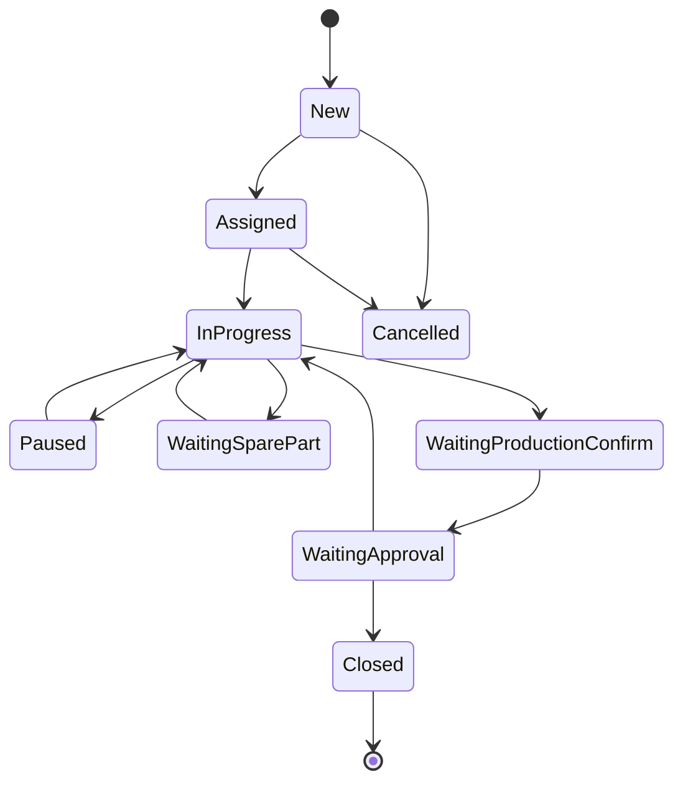
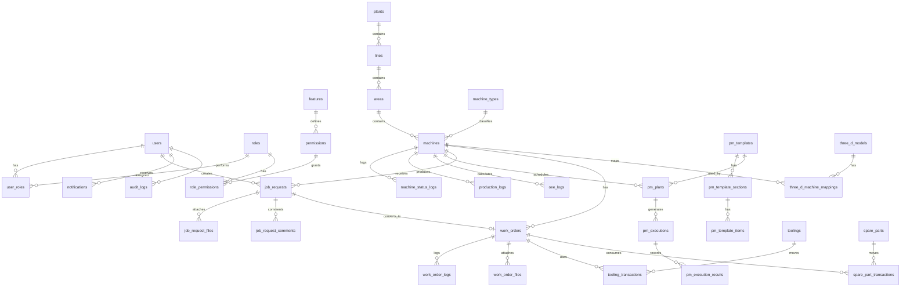

# Revised Development Plan: Maintenance PM Project

**Project:** Maintenance PM Project  
**Repository:** `apiwatapply-svg/maintenance_pm_project`  
**Planning Version:** 2.0  
**Decision:** Build from the current Git folder structure and current technology stack.  
**Realtime Standard:** Socket.IO is the primary realtime communication layer.  
**Predictive Maintenance / PdM:** Keep menu, permission, database placeholder, and future roadmap only. Do not implement PdM logic in the first development scope.

---

## 1. Planning Basis

This plan combines two sources:

1. The existing GitHub project structure and README.
2. The previous full Maintenance Management System requirement document.

The existing GitHub project already uses the following direction:

- Frontend: `frontend/my-app`
- Backend: `backend`
- Database: `database`
- Documentation: `docs`
- Tools: `tools`
- Tests: `tests`
- Frontend technology: Next.js, React, TypeScript, Bootstrap, Tailwind CSS, Axios, Socket.IO Client, Recharts, jsPDF, XLSX.
- Backend technology: Node.js, Express.js, Prisma, Socket.IO, Node-cron, Nodemailer.
- Database: SQL Server.
- Main application type: Machine Preventive Maintenance System.

Therefore, the new plan will not switch to Supabase/Vercel as the primary implementation. The new implementation must continue from the current Git repository structure and stack.

---

## 2. Major Scope Change

### 2.1 Remove PdM from Current Implementation

Predictive Maintenance / PdM must be removed from current implementation scope.

This means the following items are **not implemented now**:

- Predictive rule engine.
- Sensor trend dashboard.
- Failure prediction.
- Remaining Useful Life calculation.
- AI model training.
- PdM alert generation.
- PdM automatic job request creation.
- Sensor data ingestion for predictive analysis.

### 2.2 Keep Predictive as Future Feature

Predictive must still appear in the main feature card page, but with status:

```text
Predictive Maintenance
Status: Future
Access: Visible only to users with permission
Action: Opens Future Feature page, not real module
```

### 2.3 Future Predictive Placeholder Scope

The current version should include only:

- Main card on home page.
- Permission item in Role & Permission page.
- Future feature detail page.
- Basic database placeholder table or configuration record.
- Menu disabled or tagged as `Coming Soon`.
- Documentation explaining future implementation.

---

## 3. Revised System Goal

The system will be a realtime Preventive Maintenance and Machine Maintenance Management Web Application.

Main goals:

1. Manage machine master data.
2. Show realtime machine status via Socket.IO.
3. Display production status: actual count, target, cycle time, OEE, Availability, Performance, Quality, NG.
4. Provide a card-based home page for entering each feature.
5. Control every feature by permission from the home page and backend middleware.
6. Allow user-configurable Preventive Maintenance checklist and plan.
7. Provide fast Job Request creation.
8. Convert Job Request to Work Order.
9. Manage Storage Tooling and Spare Parts.
10. Provide analysis feature for maintenance, production, PM, OEE, downtime, tool, spare part, and job request.
11. Display 3D machine/factory view to reduce misunderstanding and reduce work steps.
12. Keep Predictive Maintenance as future roadmap only.

---

## 4. Current Repository-Based Architecture



---

## 5. Required Folder Structure

The project must keep the existing repository structure as the main base.

```text
maintenance_pm_project/
├── backend/
│   ├── controllers/
│   ├── middleware/
│   ├── prisma/
│   ├── routes/
│   ├── scripts/
│   ├── uploads/
│   ├── .env.example
│   ├── package.json
│   ├── prismaClient.js
│   ├── scheduler.js
│   └── server.js
│
├── frontend/
│   └── my-app/
│       ├── public/
│       ├── src/
│       │   ├── app/
│       │   ├── components/
│       │   ├── features/
│       │   ├── hooks/
│       │   ├── lib/
│       │   ├── services/
│       │   ├── store/
│       │   ├── types/
│       │   └── utils/
│       ├── package.json
│       ├── next.config.ts
│       ├── tsconfig.json
│       └── server.js
│
├── database/
│   ├── schema/
│   ├── migrations/
│   ├── seed/
│   └── backup/
│
├── docs/
│   ├── requirements/
│   ├── api/
│   ├── erd/
│   ├── test-plan/
│   ├── deployment/
│   └── user-manual/
│
├── tools/
│   └── email/
│
├── tests/
│   ├── api/
│   ├── e2e/
│   ├── unit/
│   └── email/
│
├── README.md
└── .gitignore
```

---

## 6. Recommended Frontend Feature Structure

Inside `frontend/my-app/src/features/`:

```text
features/
├── home/
├── auth/
├── dashboard/
├── permissions/
├── machines/
├── maintenance/
├── preventive/
├── job-request/
├── work-order/
├── tooling/
├── spare-parts/
├── analysis/
├── three-d/
├── predictive-future/
├── notifications/
└── settings/
```

Each feature should contain:

```text
feature-name/
├── components/
├── pages/
├── services/
├── hooks/
├── types.ts
└── constants.ts
```

Example:

```text
features/job-request/
├── components/
│   ├── JobRequestFastForm.tsx
│   ├── ProblemQuickSelect.tsx
│   ├── PrioritySelector.tsx
│   └── JobRequestTimeline.tsx
├── pages/
│   ├── JobRequestCreatePage.tsx
│   ├── JobRequestListPage.tsx
│   └── JobRequestDetailPage.tsx
├── services/
│   └── jobRequestApi.ts
├── hooks/
│   └── useJobRequests.ts
├── types.ts
└── constants.ts
```

---

## 7. Recommended Backend Structure

Inside `backend/`:

```text
backend/
├── controllers/
│   ├── auth.controller.js
│   ├── home.controller.js
│   ├── permission.controller.js
│   ├── machine.controller.js
│   ├── dashboard.controller.js
│   ├── pm.controller.js
│   ├── jobRequest.controller.js
│   ├── workOrder.controller.js
│   ├── tooling.controller.js
│   ├── sparePart.controller.js
│   ├── analysis.controller.js
│   ├── threeD.controller.js
│   ├── notification.controller.js
│   └── predictiveFuture.controller.js
│
├── routes/
│   ├── auth.routes.js
│   ├── home.routes.js
│   ├── permission.routes.js
│   ├── machine.routes.js
│   ├── dashboard.routes.js
│   ├── pm.routes.js
│   ├── jobRequest.routes.js
│   ├── workOrder.routes.js
│   ├── tooling.routes.js
│   ├── sparePart.routes.js
│   ├── analysis.routes.js
│   ├── threeD.routes.js
│   ├── notification.routes.js
│   └── predictiveFuture.routes.js
│
├── middleware/
│   ├── auth.middleware.js
│   ├── permission.middleware.js
│   ├── validate.middleware.js
│   ├── error.middleware.js
│   └── audit.middleware.js
│
├── services/
│   ├── socket.service.js
│   ├── permission.service.js
│   ├── audit.service.js
│   ├── oee.service.js
│   ├── pmSchedule.service.js
│   ├── notification.service.js
│   └── fileUpload.service.js
│
├── prisma/
│   ├── schema.prisma
│   ├── migrations/
│   └── seed.js
│
├── scripts/
├── uploads/
├── scheduler.js
├── server.js
└── prismaClient.js
```

---

## 8. Revised Feature List

### Current Build Scope

| Feature | Build Now | Notes |
|---|---:|---|
| Login / Auth | Yes | Existing or improve |
| Home Feature Cards | Yes | New main entry page |
| Role & Permission | Yes | Must control all feature cards |
| Dashboard | Yes | Realtime via Socket.IO |
| Machine Management | Yes | Master + realtime status |
| 3D Machine View | Yes | Basic first, advanced later |
| Preventive Maintenance | Yes | Main feature |
| PM Checklist Builder | Yes | User configurable |
| Job Request | Yes | Fast form |
| Work Order | Yes | Connect from Job Request |
| Storage Tooling | Yes | Borrow/return |
| Spare Part Inventory | Yes | Stock in/out |
| Analysis | Yes | Required |
| Reports | Yes | Excel/PDF |
| Notifications | Yes | In-app + email |
| Audit Log | Yes | Required |
| Predictive Maintenance | Placeholder only | Future |
| PdM Engine | No | Future |
| Sensor Trend | No | Future |
| AI / ML Prediction | No | Future |

---

## 9. Main Home Page Requirement

### 9.1 Page Name

`Home Feature Portal Page`

### 9.2 Purpose

This is the first page after login. It must show cards for every feature that the user has permission to access.

### 9.3 Layout

Use responsive card grid.

Desktop:

```text
4 cards per row
```

Tablet:

```text
2 cards per row
```

Mobile:

```text
1 card per row
```

### 9.4 Required Cards

1. Realtime Dashboard
2. Machine Management
3. Preventive Maintenance
4. Job Request
5. Work Order
6. Tooling Storage
7. Spare Part Inventory
8. Analysis
9. 3D Machine View
10. Reports
11. Notifications
12. User & Permission
13. Settings
14. Predictive Maintenance - Future

### 9.5 Card Data

Each card must have:

- Icon
- Feature name
- Short description
- Current status summary
- Badge count if available
- Permission state
- Button / click action

Example card:

```text
Preventive Maintenance
PM Due Today: 8
Overdue: 2
Status: Active
Action: Open
```

### 9.6 Permission Behavior

Cards must follow these rules:

| Permission State | UI Behavior |
|---|---|
| Has view permission | Show active card |
| No permission | Hide card or show locked card depending admin setting |
| Feature disabled | Show disabled card |
| Feature future | Show `Coming Soon` card |
| Has alert count | Show badge |

### 9.7 Main Card Permission Logic

Every card must be generated from backend permission response.

Frontend must not hard-code access.

Frontend call:

```http
GET /api/home/features
```

Response example:

```json
{
  "success": true,
  "data": [
    {
      "feature_key": "dashboard",
      "title": "Realtime Dashboard",
      "enabled": true,
      "future": false,
      "permissions": {
        "view": true,
        "create": false,
        "edit": false,
        "delete": false,
        "approve": false,
        "export": false
      },
      "summary": {
        "running_machines": 12,
        "alarm_machines": 2
      }
    },
    {
      "feature_key": "predictive",
      "title": "Predictive Maintenance",
      "enabled": false,
      "future": true,
      "permissions": {
        "view": true
      },
      "summary": {
        "status": "Future"
      }
    }
  ]
}
```

---

## 10. Permission System Requirement

### 10.1 Permission Must Control Everything

Permission must control:

- Home feature cards.
- Sidebar menu.
- Page access.
- API endpoint access.
- Buttons.
- Form fields where required.
- Export action.
- Approval action.
- Delete action.
- Realtime event visibility.

### 10.2 Permission Model

Use feature-based permission.

```text
feature_key + action
```

Actions:

```text
view
create
edit
delete
approve
reject
assign
export
admin
```

Example:

```text
job_request.view
job_request.create
job_request.edit
job_request.delete
work_order.assign
work_order.approve
pm_template.create
analysis.export
settings.admin
```

### 10.3 Permission Tables

Minimum tables:

```text
roles
users
user_roles
features
permissions
role_permissions
user_feature_overrides
audit_logs
```

### 10.4 Permission Enforcement Flow



### 10.5 Frontend Permission Guard

Every protected page must use:

```text
RequirePermission(featureKey, action)
```

Example:

```tsx
<RequirePermission feature="job_request" action="create">
  <JobRequestCreatePage />
</RequirePermission>
```

### 10.6 Backend Permission Middleware

Every route must specify required permission.

Example:

```js
router.post(
  "/job-requests",
  authMiddleware,
  requirePermission("job_request", "create"),
  jobRequestController.create
);
```

---

## 11. Realtime Socket.IO Architecture

### 11.1 Realtime Principle

All active features must connect through Socket.IO.

Realtime data must be pushed from backend to frontend when important records change.

### 11.2 Socket.IO Server

Socket.IO must be initialized in `backend/server.js`.

Required rooms:

```text
global
plant:{plantId}
line:{lineId}
machine:{machineId}
user:{userId}
role:{roleId}
feature:{featureKey}
work_order:{workOrderId}
job_request:{jobRequestId}
pm:{pmId}
tooling:{toolingId}
spare_part:{sparePartId}
```

### 11.3 Authentication

Socket connection must validate JWT/session token.

Connection flow:



### 11.4 Required Socket Events

#### Machine / Dashboard

```text
machine:status:update
machine:alarm:new
machine:offline
machine:oee:update
production:count:update
dashboard:summary:update
```

#### PM

```text
pm:plan:created
pm:plan:updated
pm:due:today
pm:overdue
pm:execution:started
pm:execution:submitted
pm:approval:required
pm:approved
pm:rejected
```

#### Job Request

```text
job_request:created
job_request:assigned
job_request:status_changed
job_request:comment_added
job_request:converted_to_work_order
```

#### Work Order

```text
work_order:created
work_order:assigned
work_order:started
work_order:paused
work_order:resumed
work_order:waiting_spare_part
work_order:completed
work_order:closed
work_order:approved
work_order:rejected
```

#### Tooling

```text
tooling:borrowed
tooling:return_due
tooling:returned
tooling:damaged
tooling:calibration_due
```

#### Spare Part

```text
spare_part:received
spare_part:issued
spare_part:low_stock
spare_part:out_of_stock
```

#### Analysis

```text
analysis:data_refreshed
analysis:report_ready
analysis:export_ready
```

#### Permission

```text
permission:updated
feature:access_changed
```

#### Notification

```text
notification:new
notification:read
```

#### Predictive Future

```text
predictive:future:opened
```

No real PdM alert event should be implemented now.

### 11.5 Socket Event Payload Standard

```json
{
  "event": "job_request:created",
  "timestamp": "2026-05-11T10:00:00.000Z",
  "actor": {
    "user_id": 1,
    "name": "Production User"
  },
  "data": {},
  "meta": {
    "feature": "job_request",
    "plant_id": 1,
    "line_id": 2,
    "machine_id": 10
  }
}
```

---

## 12. Feature Connection Map

### 12.1 Core Data Flow



### 12.2 Realtime Update Flow



---

## 13. Page Plan

### 13.1 Phase 1 Pages

1. Login
2. Home Feature Cards
3. Role & Permission
4. User Management
5. Machine List
6. Machine Detail
7. Realtime Dashboard
8. Job Request Create
9. Job Request List
10. Job Request Detail
11. Work Order Board
12. Work Order Detail
13. Preventive Maintenance Plan
14. PM Checklist Template
15. PM Execution
16. Analysis Overview
17. Notifications
18. Predictive Future Page

### 13.2 Phase 2 Pages

19. 3D Machine View
20. PM Calendar
21. PM Approval
22. Tooling List
23. Tooling Borrow / Return
24. Spare Part Inventory
25. Spare Part Transaction
26. Report Export
27. Machine History
28. Audit Log
29. Settings

### 13.3 Phase 3 Pages

30. Advanced 3D Layout
31. PM Compliance Analysis
32. Downtime Analysis
33. OEE Analysis
34. Tooling Analysis
35. Spare Part Analysis
36. Technician Performance
37. Predictive Roadmap Configuration

---

## 14. Detailed Home Card Plan

### 14.1 Realtime Dashboard Card

Displays:

- Running machines
- Stop machines
- Alarm machines
- OEE average
- Last update time

Action:

- Open `/dashboard`

Permission:

- `dashboard.view`

Socket events:

- `dashboard:summary:update`
- `machine:status:update`

---

### 14.2 Machine Management Card

Displays:

- Total machines
- Active machines
- Inactive machines
- Machines without PM plan

Action:

- Open `/machines`

Permission:

- `machine.view`

Socket events:

- `machine:status:update`

---

### 14.3 Preventive Maintenance Card

Displays:

- PM due today
- PM overdue
- PM waiting approval
- PM completed today

Action:

- Open `/preventive`

Permission:

- `preventive.view`

Socket events:

- `pm:due:today`
- `pm:overdue`
- `pm:approval:required`
- `pm:approved`

---

### 14.4 Job Request Card

Displays:

- New job requests
- Critical requests
- Waiting assignment
- Requests today

Action:

- Open `/job-requests`

Permission:

- `job_request.view`

Socket events:

- `job_request:created`
- `job_request:status_changed`

---

### 14.5 Work Order Card

Displays:

- Assigned work orders
- In progress
- Waiting spare part
- Waiting approval
- Overdue SLA

Action:

- Open `/work-orders`

Permission:

- `work_order.view`

Socket events:

- `work_order:created`
- `work_order:status_changed`

---

### 14.6 Tooling Storage Card

Displays:

- Available tools
- Tools in use
- Overdue return
- Calibration due

Action:

- Open `/tooling`

Permission:

- `tooling.view`

Socket events:

- `tooling:borrowed`
- `tooling:returned`
- `tooling:return_due`

---

### 14.7 Spare Part Card

Displays:

- Low stock
- Out of stock
- Issued today
- Received today

Action:

- Open `/spare-parts`

Permission:

- `spare_part.view`

Socket events:

- `spare_part:low_stock`
- `spare_part:issued`
- `spare_part:received`

---

### 14.8 Analysis Card

Displays:

- OEE today
- Downtime today
- PM compliance
- Top problem machine

Action:

- Open `/analysis`

Permission:

- `analysis.view`

Socket events:

- `analysis:data_refreshed`
- `machine:oee:update`
- `work_order:closed`

---

### 14.9 3D Machine View Card

Displays:

- 3D layout status
- Machines mapped
- Active alarms
- Active jobs

Action:

- Open `/3d-view`

Permission:

- `three_d.view`

Socket events:

- `machine:status:update`
- `job_request:created`
- `pm:due:today`

---

### 14.10 Predictive Future Card

Displays:

- Status: Future
- Short description: Future PdM module for sensor trend and machine health prediction

Action:

- Open `/predictive/future`

Permission:

- `predictive.view`

Rules:

- Do not show real alert count.
- Do not create PdM API logic.
- Do not create sensor trend logic.
- Keep as roadmap page.

---

## 15. Analysis Feature Requirement

### 15.1 Purpose

The Analysis feature is a central place for analyzing maintenance and production data.

### 15.2 Analysis Pages

1. Analysis Overview
2. OEE Analysis
3. Downtime Analysis
4. Job Request Analysis
5. Work Order Analysis
6. PM Compliance Analysis
7. Machine Problem Analysis
8. Tooling Usage Analysis
9. Spare Part Usage Analysis
10. Technician Performance Analysis
11. Export Analysis Report

### 15.3 Analysis Overview Widgets

- OEE today
- OEE trend
- Availability trend
- Performance trend
- Quality trend
- Downtime total
- MTBF
- MTTR
- PM compliance
- Top 10 machines by downtime
- Top 10 problem categories
- Job request response time
- Work order completion rate
- Spare part cost
- Tool usage ranking

### 15.4 Required KPI Formulas

```text
OEE = Availability × Performance × Quality
Availability = Operating Time / Planned Production Time
Performance = Ideal Cycle Time × Total Count / Operating Time
Quality = Good Count / Total Count
MTBF = Total Running Time / Number of Failures
MTTR = Total Repair Time / Number of Repairs
PM Compliance = Completed PM On Time / Total Scheduled PM
Job Response Time = First Assigned Time - Request Created Time
Repair Time = Work Order End Time - Work Order Start Time
```

### 15.5 Analysis Data Sources

| Analysis | Source Tables |
|---|---|
| OEE | machine_status_logs, production_logs |
| Downtime | machine_status_logs, work_orders |
| Job Request | job_requests |
| Work Order | work_orders, work_order_logs |
| PM | pm_plans, pm_executions, pm_results |
| Tooling | toolings, tooling_transactions |
| Spare Part | spare_parts, spare_part_transactions |
| Technician | work_orders, pm_executions |
| Machine Problem | job_requests, work_orders |

### 15.6 Realtime Analysis

Analysis cards must update when source data changes via Socket.IO.

Example:

- Work order closed -> update MTTR, downtime, technician performance.
- New job request -> update job request count and response time.
- PM approved -> update PM compliance.
- Machine status update -> update OEE and downtime.

---

## 16. Preventive Maintenance Revised Scope

### 16.1 PM Must Be User Configurable

Users with permission must create and edit:

- PM type
- PM plan
- PM checklist template
- PM checklist sections
- PM checklist items
- Required evidence
- Required measurement range
- Required tools
- Required spare parts
- Approval workflow

### 16.2 PM Checklist Item Types

- OK / NG
- Pass / Fail
- Text
- Number
- Measurement
- Dropdown
- Multi-select
- Date
- Time
- Photo required
- File required
- Signature
- Remark

### 16.3 PM Flow



### 16.4 PM Socket Events

- `pm:plan:created`
- `pm:due:today`
- `pm:overdue`
- `pm:execution:started`
- `pm:execution:submitted`
- `pm:approval:required`
- `pm:approved`
- `pm:rejected`

---

## 17. Job Request Revised Scope

### 17.1 Fast Input Requirement

The Job Request form must be completed within 30 to 60 seconds.

### 17.2 Fast Form Design

Step 1: Machine

- Search by machine code.
- Scan QR.
- Select from recent machine.
- Open from 3D machine popup.
- Auto-fill line, area, status.

Step 2: Problem

- Quick category buttons.
- Quick symptom buttons.
- Optional description.

Step 3: Impact

- Priority buttons.
- Production impact yes/no.
- Machine stopped yes/no.
- NG count optional.

Step 4: Evidence

- Photo from camera.
- Submit.

### 17.3 Auto Create Work Order Rule

Configurable:

```text
If priority = Critical and production impact = true
Then auto create Work Order and notify Maintenance Manager
```

### 17.4 Job Request Connects To

- Machine
- 3D position
- Work Order
- PM history
- Spare Part usage through Work Order
- Tool usage through Work Order
- Analysis
- Notification

---

## 18. Work Order Revised Scope

### 18.1 Work Order Kanban Columns

- New
- Assigned
- In Progress
- Paused
- Waiting Spare Part
- Waiting Production Confirm
- Waiting Approval
- Completed
- Closed
- Cancelled

### 18.2 Work Order Required Actions

- Create from Job Request
- Manual create
- Assign technician
- Start job
- Pause job
- Resume job
- Request spare part
- Borrow tool
- Add root cause
- Add corrective action
- Add preventive action
- Upload before/after photos
- Submit for approval
- Production confirm
- Manager approve
- Close

### 18.3 Status Transition Rules



---

## 19. Storage Tooling Revised Scope

### 19.1 Tooling Must Connect To Work Order

Every borrow transaction should optionally or mandatorily link to a Work Order.

### 19.2 Tooling Main Functions

- Tool master
- Tool category
- Tool location
- Borrow tool
- Return tool
- Damage record
- Calibration due
- Tool history
- QR code
- Tool usage analysis

### 19.3 Socket Events

- `tooling:borrowed`
- `tooling:returned`
- `tooling:damaged`
- `tooling:return_due`
- `tooling:calibration_due`

---

## 20. Spare Part Revised Scope

### 20.1 Spare Part Must Connect To Work Order

Every issue transaction should link to Work Order.

### 20.2 Functions

- Spare part master
- Stock receive
- Stock issue
- Stock return
- Stock adjust
- Low stock alert
- Out of stock alert
- Machine compatibility
- Usage history
- Cost analysis

### 20.3 Socket Events

- `spare_part:received`
- `spare_part:issued`
- `spare_part:low_stock`
- `spare_part:out_of_stock`

---

## 21. 3D View Revised Scope

### 21.1 Build in Two Levels

Level 1 - Basic:

- Show 3D model.
- Machine markers.
- Color by machine status.
- Click marker to show machine popup.
- Open Job Request from popup.
- Open Machine Detail from popup.

Level 2 - Advanced:

- Full factory layout.
- Multiple layers.
- PM point.
- Job request point.
- Tooling area.
- Spare part room.
- Heatmap.
- Camera focus.

### 21.2 3D Must Connect To

- Machine status
- Job request
- Work order
- PM due
- Analysis
- Future Predictive

---

## 22. Dashboard Revised Scope

### 22.1 Dashboard Data

- Machine status summary
- Machine status card
- Actual count
- Target count
- Good count
- NG count
- Cycle time actual
- Cycle time target
- OEE
- Availability
- Performance
- Quality
- Job request count
- Work order count
- PM due / overdue
- Spare part low stock
- Tool overdue

### 22.2 Dashboard Realtime Source

All dashboard updates must come through Socket.IO.

Backend should emit events after any insert/update that affects dashboard.

### 22.3 Machine Simulator

Current system can use a Node.js or Python simulator.

Since current repo stack is Node.js + Express + Prisma + SQL Server, recommended first version:

- Use Node.js simulator script inside `backend/scripts`.
- Keep optional Python simulator in future or separate folder if required.

If Python is required now, add:

```text
tools/machine-simulator-python/
```

but it must write to backend API, not directly bypass backend.

---

## 23. API Plan

### 23.1 API Standard

Base URL:

```text
/api
```

Response:

```json
{
  "success": true,
  "data": {},
  "message": "OK"
}
```

Error:

```json
{
  "success": false,
  "error": {
    "code": "PERMISSION_DENIED",
    "message": "You do not have permission.",
    "details": []
  }
}
```

### 23.2 API Groups

```text
/auth
/home
/permissions
/users
/machines
/dashboard
/preventive
/job-requests
/work-orders
/tooling
/spare-parts
/analysis
/three-d
/notifications
/settings
/predictive-future
```

### 23.3 Important Endpoints

#### Home

```http
GET /api/home/features
GET /api/home/summary
```

#### Permission

```http
GET /api/permissions/features
GET /api/permissions/roles
GET /api/permissions/roles/:id
PUT /api/permissions/roles/:id
POST /api/permissions/check
```

#### Dashboard

```http
GET /api/dashboard/summary
GET /api/dashboard/machines
GET /api/dashboard/oee
```

#### Machine

```http
GET /api/machines
GET /api/machines/:id
POST /api/machines
PUT /api/machines/:id
DELETE /api/machines/:id
GET /api/machines/:id/status
GET /api/machines/:id/history
POST /api/machines/:id/status
```

#### Preventive

```http
GET /api/preventive/plans
POST /api/preventive/plans
PUT /api/preventive/plans/:id
GET /api/preventive/templates
POST /api/preventive/templates
PUT /api/preventive/templates/:id
POST /api/preventive/templates/:id/items
GET /api/preventive/calendar
POST /api/preventive/executions/:id/start
POST /api/preventive/executions/:id/submit
POST /api/preventive/executions/:id/approve
POST /api/preventive/executions/:id/reject
```

#### Job Request

```http
GET /api/job-requests
POST /api/job-requests
GET /api/job-requests/:id
PUT /api/job-requests/:id
POST /api/job-requests/:id/assign
POST /api/job-requests/:id/convert-work-order
POST /api/job-requests/:id/comment
POST /api/job-requests/:id/files
```

#### Work Order

```http
GET /api/work-orders
POST /api/work-orders
GET /api/work-orders/:id
PUT /api/work-orders/:id
POST /api/work-orders/:id/assign
POST /api/work-orders/:id/start
POST /api/work-orders/:id/pause
POST /api/work-orders/:id/resume
POST /api/work-orders/:id/request-spare-part
POST /api/work-orders/:id/borrow-tool
POST /api/work-orders/:id/submit
POST /api/work-orders/:id/production-confirm
POST /api/work-orders/:id/approve
POST /api/work-orders/:id/reject
POST /api/work-orders/:id/close
```

#### Analysis

```http
GET /api/analysis/overview
GET /api/analysis/oee
GET /api/analysis/downtime
GET /api/analysis/job-requests
GET /api/analysis/work-orders
GET /api/analysis/pm-compliance
GET /api/analysis/tooling
GET /api/analysis/spare-parts
GET /api/analysis/technicians
POST /api/analysis/export
```

#### Predictive Future

```http
GET /api/predictive-future/info
```

No create/update PdM rule endpoints in current implementation.

---

## 24. Database Plan

### 24.1 Core Tables

```text
users
roles
features
permissions
role_permissions
user_roles
user_feature_overrides
departments
plants
lines
areas
machines
machine_types
machine_status_logs
production_logs
oee_logs
pm_types
pm_templates
pm_template_sections
pm_template_items
pm_plans
pm_executions
pm_execution_results
job_requests
job_request_files
job_request_comments
work_orders
work_order_logs
work_order_files
toolings
tooling_categories
tooling_transactions
spare_parts
spare_part_categories
spare_part_transactions
notifications
notification_targets
three_d_models
three_d_machine_mappings
analysis_snapshots
audit_logs
settings
future_features
```

### 24.2 Predictive Future Tables

Do not create full PdM tables now.

Only create:

```text
future_features
```

Example record:

```text
feature_key = predictive
name = Predictive Maintenance
status = future
target_phase = Phase 6+
description = Future module for sensor trend, PdM alerts, and failure prediction
```

Optional future design docs can be in `docs/requirements/predictive-future.md`.

### 24.3 ER Diagram



---

## 25. Development Phase Plan

### Phase 0: Repository Stabilization

Goal: Prepare project foundation.

Tasks:

1. Pull latest repository.
2. Confirm backend runs on port 5003.
3. Confirm frontend runs on port 3000.
4. Review `.env.example`.
5. Review Prisma schema.
6. Review existing routes/controllers.
7. Add documentation folder structure.
8. Add branch `develop`.
9. Add issue list or task board.
10. Add lint/build commands if missing.

Deliverables:

- Running local frontend.
- Running local backend.
- Working database connection.
- Updated README.
- Development checklist.

---

### Phase 1: Auth + Permission + Home Cards

Goal: Make homepage the main entry point with permission-controlled feature cards.

Tasks:

1. Implement or review login.
2. Build permission database.
3. Add feature master table.
4. Add role permission table.
5. Create `/api/home/features`.
6. Build `HomeFeatureCard`.
7. Build `HomeFeatureGrid`.
8. Show only allowed cards.
9. Add locked/future card mode.
10. Add Predictive Future card.
11. Add permission middleware to backend.
12. Add frontend route guard.
13. Emit `permission:updated` when permission changes.
14. Refresh user permission via Socket.IO.

Deliverables:

- Login works.
- Home cards work.
- Permissions control cards and APIs.
- Predictive appears as future only.

---

### Phase 2: Machine + Realtime Dashboard

Goal: Create machine data foundation and realtime dashboard.

Tasks:

1. Machine master CRUD.
2. Machine type CRUD.
3. Plant / line / area setup.
4. Machine status log table.
5. Production log table.
6. OEE calculation service.
7. Socket.IO machine status rooms.
8. Dashboard summary API.
9. Dashboard machine cards.
10. Realtime machine status event.
11. Offline detection.
12. Basic machine simulator script.
13. Dashboard card update without refresh.

Deliverables:

- Dashboard realtime.
- Machine status cards.
- Actual, target, cycle time, OEE, A, P, Q, NG visible.

---

### Phase 3: Preventive Maintenance

Goal: Build PM planning and execution.

Tasks:

1. PM type setup.
2. PM template CRUD.
3. PM checklist section builder.
4. PM checklist item builder.
5. PM plan CRUD.
6. Node-cron PM generation.
7. PM execution page.
8. PM result save.
9. PM approval flow.
10. PM overdue logic.
11. PM notification.
12. Socket.IO PM events.
13. PM analysis data.

Deliverables:

- User can create maintenance topics.
- User can define maintenance details.
- PM tasks auto-generate.
- Technician can complete PM.
- Manager can approve.

---

### Phase 4: Job Request + Work Order

Goal: Build complete corrective maintenance flow.

Tasks:

1. Job request fast form.
2. Machine auto-fill.
3. Problem category/symptom setup.
4. File upload.
5. Job request list/detail.
6. Assign technician.
7. Convert to work order.
8. Work order Kanban.
9. Work order detail.
10. Start/pause/resume/close actions.
11. Root cause and corrective action.
12. Production confirm.
13. Manager approval.
14. Socket.IO job/work events.
15. Job and work analysis.

Deliverables:

- User can submit job request quickly.
- Maintenance can manage work order.
- Dashboard and home cards update realtime.

---

### Phase 5: Tooling + Spare Part

Goal: Connect resource usage to work orders.

Tasks:

1. Tooling master.
2. Tool borrowing.
3. Tool return.
4. Tool calibration due.
5. Spare part master.
6. Stock receive.
7. Stock issue.
8. Stock return.
9. Low stock alert.
10. Link transactions to work order.
11. Socket.IO resource events.
12. Resource usage analysis.

Deliverables:

- Tooling borrow/return works.
- Spare part stock movement works.
- Low stock alerts work.
- Cost and usage can be analyzed.

---

### Phase 6: Analysis + Reports

Goal: Add integrated analytics.

Tasks:

1. Analysis overview.
2. OEE analysis.
3. Downtime analysis.
4. PM compliance analysis.
5. Job request analysis.
6. Work order analysis.
7. Tooling analysis.
8. Spare part analysis.
9. Technician performance.
10. Export Excel.
11. Export PDF.
12. Realtime refresh events.

Deliverables:

- Analysis feature works.
- Every module connects to analysis.
- Exports available by permission.

---

### Phase 7: 3D Machine View

Goal: Add visual machine navigation.

Tasks:

1. Add 3D model upload.
2. Add machine-to-3D mapping.
3. Build 3D scene.
4. Build machine markers.
5. Color markers by status.
6. Popup machine info.
7. Create job request from 3D popup.
8. Open machine detail from 3D popup.
9. Show PM due marker.
10. Show job request marker.
11. Socket.IO status update to 3D.

Deliverables:

- 3D model helps navigate machines.
- Machine status changes in realtime.

---

### Phase 8: Hardening + Test + Deploy

Goal: Prepare production quality.

Tasks:

1. Unit tests.
2. API tests.
3. E2E tests.
4. Permission tests.
5. Socket.IO tests.
6. Performance tests.
7. Build test.
8. Deployment docs.
9. Backup docs.
10. Error logs and audit logs.
11. Security review.
12. UAT checklist.

Deliverables:

- Stable release candidate.
- Test report.
- Deployment guide.
- UAT sign-off.

---

## 26. Testing Plan

### 26.1 Unit Test

Must cover:

- OEE calculation.
- Permission check.
- PM schedule generation.
- Job request validation.
- Work order status transition.
- Tool borrow/return.
- Spare part stock calculation.

### 26.2 API Test

Must cover:

- Auth.
- Permission denied.
- Create/read/update/delete.
- Validation errors.
- Pagination.
- File upload.
- Workflows.

### 26.3 Socket.IO Test

Must cover:

- Connect with token.
- Reject invalid token.
- Join correct rooms.
- Machine status update event.
- Job request created event.
- Work order status changed event.
- Permission update event.

### 26.4 E2E Test

Main flow:

```text
Login
Open Home
Create Job Request
Assign Technician
Start Work Order
Borrow Tool
Issue Spare Part
Close Work Order
Approve
Open Analysis
Verify KPI changed
```

### 26.5 UAT

User groups:

- Admin
- Maintenance Manager
- Technician
- Production User
- Store Keeper
- Management Viewer

---

## 27. Git Workflow

### 27.1 Branches

```text
main
develop
feature/home-permission-cards
feature/realtime-dashboard
feature/preventive-maintenance
feature/job-request-work-order
feature/tooling-spare-part
feature/analysis
feature/three-d-view
feature/predictive-future
bugfix/*
hotfix/*
release/*
```

### 27.2 Commit Convention

```text
feat: add home feature cards
fix: correct OEE calculation
docs: update API spec
test: add work order e2e test
refactor: split permission middleware
chore: update dependencies
```

### 27.3 Pull Request Checklist

- Code builds.
- Lint passes.
- Unit tests pass.
- API tests pass if backend changed.
- Prisma migration reviewed.
- Permission added for new feature.
- Socket event documented if realtime added.
- Docs updated.

---

## 28. Environment Variables

Backend:

```env
PORT=5003
DATABASE_URL="sqlserver://..."
JWT_SECRET=
UPLOAD_DIR=uploads
EMAIL_HOST=
EMAIL_PORT=
EMAIL_USER=
EMAIL_PASS=
SOCKET_CORS_ORIGIN=http://localhost:3000
```

Frontend:

```env
NEXT_PUBLIC_API_URL=http://localhost:5003/api
NEXT_PUBLIC_SOCKET_URL=http://localhost:5003
```

---

## 29. Key Acceptance Criteria

### 29.1 Home Cards

- Cards show based on permission.
- Predictive shows as future only.
- Card badges update via Socket.IO.
- No unauthorized feature can be opened.

### 29.2 Permission

- Frontend blocks unauthorized page.
- Backend blocks unauthorized API.
- Button actions hide or disable correctly.
- Permission changes update without logout.

### 29.3 Realtime

- Machine status updates without refresh.
- Job request count updates without refresh.
- Work order board updates without refresh.
- PM due/overdue updates without refresh.
- Tool/spare alerts update without refresh.

### 29.4 Preventive

- User can create PM template.
- User can create custom checklist.
- PM schedule can be generated.
- Technician can submit result.
- Manager can approve.

### 29.5 Job Request

- Production user can submit job request within 30-60 seconds.
- Machine info auto-fills.
- Photo can be attached.
- Critical request notifies maintenance immediately.

### 29.6 Analysis

- OEE, downtime, PM compliance, MTBF, MTTR display correctly.
- Data connects from machine, PM, job, work order, tooling, and spare part.
- Export controlled by permission.

### 29.7 Predictive Future

- Predictive card exists.
- Predictive cannot run real PdM function.
- Documentation says future implementation.

---

## 30. What Must Be Added To Existing Git Project

1. Permission-based feature system.
2. Home card portal.
3. Backend permission middleware.
4. Socket.IO room and event standard.
5. Realtime dashboard event flow.
6. Analysis feature.
7. Predictive future placeholder.
8. PM checklist builder improvement.
9. Work order full lifecycle.
10. Tooling and spare part connection to work order.
11. 3D view connection to machine/job/PM.
12. API documentation.
13. ER diagram documentation.
14. Test plan.
15. Audit log.
16. UAT checklist.
17. Deployment guide.

---

## 31. Recommended Next Development Order

Start with this exact order:

1. Create `develop` branch.
2. Review existing database schema.
3. Add `features`, `permissions`, `role_permissions` tables.
4. Add backend permission middleware.
5. Add `/api/home/features`.
6. Build Home Feature Card page.
7. Add Predictive Future card.
8. Add Socket.IO auth and room structure.
9. Build realtime Dashboard.
10. Build Machine status simulator.
11. Build PM Checklist Builder.
12. Build PM Plan and Execution.
13. Build Job Request Fast Form.
14. Build Work Order Board.
15. Build Tooling and Spare Part.
16. Build Analysis.
17. Build 3D View.
18. Add tests and docs.

---

# End of Revised Plan
